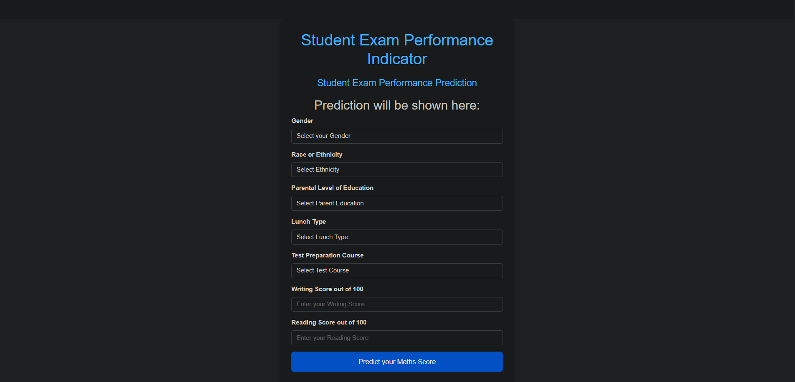

## End To End Project 
<h1 align="center">🎓 Student Exam Performance Indicator</h1>

<p align="center">
  Predicting student math scores with Machine Learning  
</p>

This project predicts **student math scores** based on demographic and academic features such
as gender, ethnicity, parental education, lunch type, test preparation, and prior subject scores.  
It is an **end-to-end Machine Learning project** that includes data exploration, model training, evaluation, and deployment with Flask and AWS Elastic Beanstalk.

---

<p align="center">
  <a href="http://end-to-end-sp-env.eba-pan9vuxm.ap-south-1.elasticbeanstalk.com/">
    
  </a>
</p>


---


## 📊 Dataset

- **Rows:** 1000  
- **Columns:** 10  
- **Features:**
  - `gender` – Male / Female  
  - `race_ethnicity` – Groups A–E  
  - `parental_level_of_education` – Highest qualification of parents  
  - `lunch` – Free/reduced or standard  
  - `test_preparation_course` – Completed / None  
  - `math_score`, `reading_score`, `writing_score` – Exam scores out of 100  
  - `total score` – Sum of three scores  
  - `average` – Mean score across all subjects  

📌 **Target Variable:** `math_score` (to be predicted)

---

## ⚙️ Project Structure

Project/
├── application.py        # Flask app entry point
├── requirements.txt      # Dependencies
├── setup.py              # Setup script
├── README.md             # Documentation
├── .gitignore            # Ignore rules
│
├── artifact/             # Trained models & preprocessors
│   ├── model.pkl
│   └── preprocessor.pkl
│
├── datasets/             # Datasets
├── logs/                 # Logging
├── notebook/             # Jupyter notebooks
│   └── EDA.ipynb
│
├── src/                  # Source code
│   ├── exception.py
│   ├── logger.py
│   ├── utils.py
│   ├── components/       # Data ingestion, transformation, trainer
│   └── pipelines/        # Training & prediction pipelines
│
├── templates/            # HTML templates (Flask UI)
│   ├── index.html
│   └── home.html
│
└── .ebextensions/        # Elastic Beanstalk configs

---

## 🧠 Model Training

We experimented with multiple machine learning regressors and hyperparameter tuning:

- **Random Forest Regressor**
- **Decision Tree Regressor**
- **Gradient Boosting Regressor**
- **Linear Regression**
- **XGBoost Regressor**
- **CatBoost Regressor**
- **AdaBoost Regressor**

Each model was tuned with a parameter grid, and performance was compared using **R² Score**.

✅ The best-performing model is automatically selected and saved as `artifact/model.pkl`.

---

## 📈 Evaluation

- **Metric:** R² Score (`sklearn.metrics.r2_score`)  
- The best model selected after hyperparameter tuning was:  

```python
RandomForestRegressor(min_samples_leaf=4, min_samples_split=5, n_estimators=300)
```

- R² Score: ~0.83 on the test dataset 🎯
- Models with R² < 0.6 were discarded automatically.
- The chosen model is persisted as artifact/model.pkl and later used by the Flask app for predictions.

---

## 🌐 Deployment

- **Framework:** Flask  
- **Frontend:** HTML templates (`index.html`, `home.html`)  
- **Cloud:** AWS Elastic Beanstalk  
- **CI/CD:** AWS CodePipeline  

---

## 🚀 Local Usage 

### 1️⃣ Clone the repository
```bash
git clone https://github.com/your-username/StudentPerformancePredictor.git
cd StudentPerformancePredictor
```
### 2️⃣ Install dependencies
```bash
pip install -r requirements.txt
```
### 3️⃣ Run locally
```bash
python application.py
```
App will be available at http://127.0.0.1:5000 or http://localhost:5000/

---

## 📷 Screenshots

### Input Form


### Prediction Page


---

## 🔮 Future Improvements
- Add deep learning models for score prediction  
- Deploy using Docker + Kubernetes  
- Enhance frontend with modern UI framework  
- Include feature importance visualizations  
